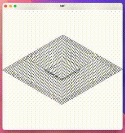

# FdF - Wireframe Viewer

**FdF** (Fil de Fer) is a 3D wireframe map visualizer written in C using the **MLX42** graphics library. It takes a `.fdf` file as input, representing a grid of elevation values, and renders a 3D wireframe projection in a 2D window. Built as part of the 42 School curriculum, this project demonstrates graphics programming, transformation matrices, event handling, and custom memory management.


## Features

- Isometric, parallel, and conic (perspective) projections
- Real-time transformations (translate, rotate, scale) via keyboard
- Interactive rendering with MLX42 + GLFW
- Smooth color gradients and Z-buffering for proper depth handling
- Custom memory management using a lightweight garbage collector
- Automatic scaling and centering for varying map sizes


## Screenshots


---

## Dependencies

This project depends on:

- [MLX42](https://github.com/codam-coding-college/MLX42) (requires CMake)
- `glfw`, `cmake`, `libpthread`, `libm`

Install via Homebrew (for macOS, including M1/M2 chips):

```bash
brew install cmake glfw
```

## Build
Clone the repository and run

```bash
make
```

This will:
Build libft, ft_printf, and MLX42
Compile all project source files
Link everything into the fdf executable

## Usage
```bash
./fdf path/to/map.fdf
```

### Controls

| Key         | Action                          |
|-------------|---------------------------------|
| W/A/S/D     | Translate on X/Y axes           |
| Q/E         | Translate on Z axis             |
| ←/→/↑/↓     | Move image in 2D space          |
| Z/X         | Zoom in/out                     |
| TAB         | Switch transformation mode      |
| SPACE       | Toggle auto-centering           |
| 1           | Isometric projection            |
| 2           | Parallel projection             |
| 3           | Conic (perspective) projection  |
| ESC         | Exit the application            |

### Map file format
.fdf files define a grid of elevation values, optionally with colors:

```bash
0  1  2
3  4  5
6,0xFF0000 7 8
```

Each number represents a height (z), and optional colors can be specified in hexadecimal format

---

## General Info

### Code Structure
- main.c – program entry point and initialization
- parsing.c – file parsing and input validation
- projection.c – 3D to 2D projections (isometric, parallel, conic)
- transform_map.c – transformation of 3D map coordinates
- transform_image.c – transformation of 2D projected pixels
- line.c – line drawing via Bresenham’s algorithm
- keyhook.c – interactive keyboard handling
- gc_alloc.c/h – custom garbage collection and memory handling


### Memory management
The project includes a garbage collection module that tracks all dynamic allocations and automatically frees memory on error or exit. This simplifies memory management and prevents leaks, please check `libft/gc_alloc` for details.
